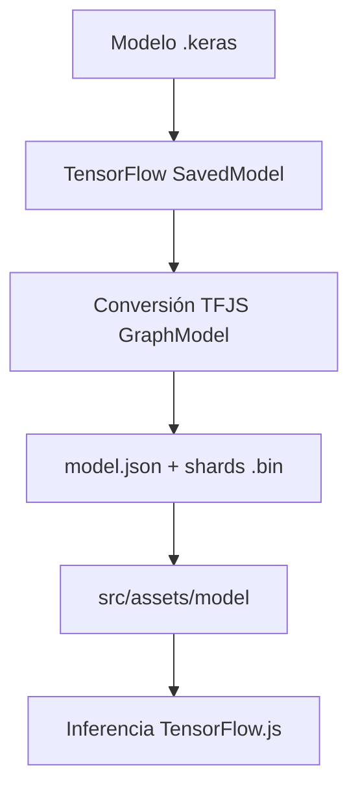
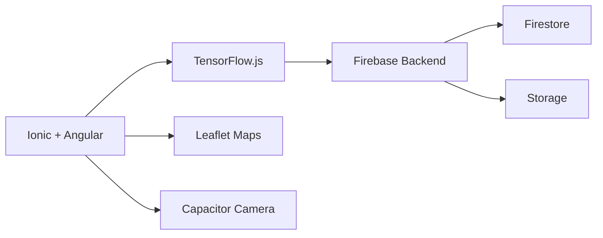
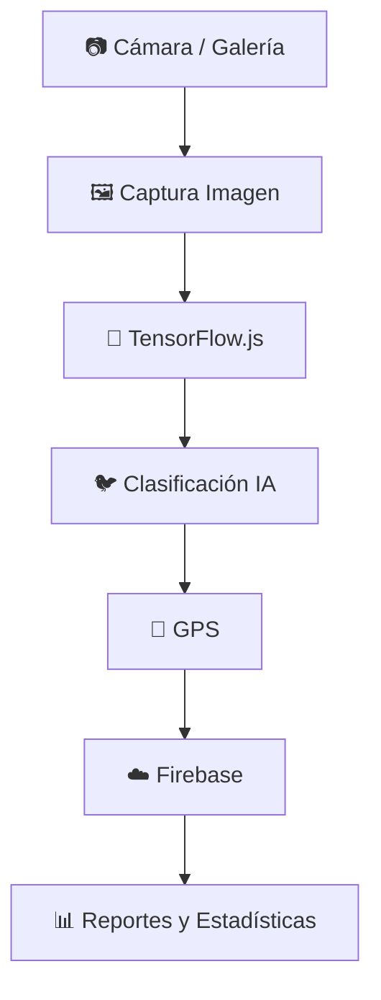

<div align="center">

# 🐦 BirdScope

### Sistema Inteligente de Reconocimiento de Aves usando IA + TensorFlow.js

<br>


<br><br>


</div>

---

# 📱 Descripción General

**BirdScope** es una aplicación móvil híbrida orientada al reconocimiento inteligente de aves mediante técnicas de **Inteligencia Artificial** y **Visión por Computadora**.

El sistema permite capturar imágenes directamente desde la cámara del dispositivo móvil o cargar fotografías desde la galería para clasificarlas automáticamente utilizando un modelo de Deep Learning entrenado con **41 especies de aves del Tolima, Colombia 🇨🇴**.

La aplicación integra tecnologías modernas móviles, sincronización en tiempo real, geolocalización GPS, mapas interactivos e inferencia IA local usando TensorFlow.js.

---

# 🚀 Características Principales

<div align="center">

| Característica | Descripción |
|---|---|
| 🧠 Clasificación IA | Reconocimiento de aves en tiempo real |
| 📷 Cámara Integrada | Captura móvil de imágenes |
| ☁️ Firebase | Sincronización en la nube |
| 📍 GPS Automático | Geolocalización de registros |
| 🗺️ Mapas Interactivos | Leaflet + OpenStreetMap |
| 📊 Reportes Dinámicos | Estadísticas en tiempo real |
| 📱 Optimización Móvil | Compatible Android/Web |
| ⚡ TensorFlow.js | Inferencia IA local |

</div>

---

# ✨ Módulos Principales

---

## 🏠 Inicio

- Dashboard interactivo
- Estadísticas dinámicas
- Accesos rápidos
- Especies destacadas
- Diseño responsive moderno
- Información conectada con Firebase

---

## 🧠 Clasificación Inteligente

- Captura desde cámara
- Carga desde galería
- Clasificación automática en tiempo real
- Top 3 de predicciones
- Porcentaje de confianza
- Confirmación manual de especies
- Reporte de especies no identificadas
- Compresión automática de imágenes
- Integración con TensorFlow.js
- Inferencia local sin servidor

---

## 🌿 Catálogo de Especies

- 41 especies registradas
- Buscador en tiempo real
- Filtros por familia
- Ordenamiento dinámico
- Modal interactivo
- Información científica
- Datos de hábitat
- Recomendaciones dinámicas
- Detección de especies registradas

---

## 🗺️ Mapa Inteligente

- Avistamientos GPS
- Marcadores dinámicos
- Identificación por colores
- Sistema de búsqueda inteligente
- Navegación automática
- Popups interactivos
- Vista mapa/lista
- Integración OpenStreetMap
- Renderizado Leaflet

---

## 📊 Reportes y Estadísticas

- Total de observaciones
- Número de especies únicas
- Promedio de confianza IA
- Historial completo
- Barras de progreso
- Últimos avistamientos
- Estadísticas conectadas en tiempo real

---

# 🧠 Pipeline de Inteligencia Artificial

BirdScope utiliza una arquitectura de Deep Learning optimizada para inferencia móvil mediante técnicas de Transfer Learning.

---

## 🏗️ Arquitectura del Modelo

| Modelo | Función |
|---|---|
| CNN Padre | Extracción de características |
| CNN Hijo | Clasificación móvil |
| TensorFlow.js | Inferencia local |
| MobileNetV2 | Arquitectura base |

---

## 📦 Modelo Optimizado

```txt
hijo_fase2_FINAL.keras
```

### Características

- Clasificación de 41 especies
- Optimizado para TensorFlow.js
- Inferencia rápida móvil
- Compatible Android/Web
- Soporte offline
- Arquitectura ligera

---

# 🔄 Pipeline de Conversión TensorFlow.js



---

# 📂 Estructura del Modelo IA

```txt
src/assets/model/
├── model.json
├── group1-shard1of3.bin
├── group1-shard2of3.bin
├── group1-shard3of3.bin
└── weights.bin
```

---

# 🧠 Función de los Archivos del Modelo

| Archivo | Función |
|---|---|
| model.json | Arquitectura principal del modelo IA |
| group1-shard1of3.bin | Primera parte de pesos entrenados |
| group1-shard2of3.bin | Segunda parte de pesos entrenados |
| group1-shard3of3.bin | Tercera parte de pesos entrenados |
| weights.bin | Pesos adicionales del modelo |

---

# 🐦 Especies Soportadas

La aplicación reconoce automáticamente **41 especies de aves del Tolima**, incluyendo:

- Aguililla Caminera
- Bananaquit
- Chachalaca Colombiana
- Colibrí Florido de Tolima
- Halcón Peregrino
- Momoto Serrano
- Tángara Azulgris
- Zopilote Común
- Benteveo
- Tortolita Canela
- Entre muchas otras...

---

# ☁️ Firebase

BirdScope utiliza Firebase como infraestructura backend centralizada.

---

## 🔥 Servicios Integrados

<div align="center">

| Servicio | Uso |
|---|---|
| Firestore | Base de datos de avistamientos |
| Firebase Storage | Almacenamiento de imágenes |
| Firebase Authentication | Gestión de usuarios |

</div>

---

# 📄 Ejemplo Documento Firestore

```json
{
  "especie": "Bananaquit",
  "confianza": 93,
  "imagen": "data:image/jpeg;base64,...",
  "latitud": 4.415071,
  "longitud": -75.174409,
  "fecha": "2026-05-08T05:54:30.061Z"
}
```

---

# 🤝 Arquitectura Compartida Firebase

BirdScope utiliza un único proyecto Firebase como backend centralizado.

Esto permite que múltiples integrantes del equipo puedan ejecutar la aplicación desde diferentes dispositivos (PC o móvil) trabajando sobre la misma base de datos en tiempo real.

El sistema soporta:

- Sincronización Firestore compartida
- Almacenamiento centralizado
- Actualizaciones en tiempo real
- Trabajo colaborativo
- Sincronización entre dispositivos

---

# 🏗️ Arquitectura del Sistema



---

# 🔄 Flujo General del Sistema



---

# 📂 Estructura del Proyecto

```txt
src/
├── app/
│   └── tabs/
│       ├── inicio/
│       ├── clasificar/
│       ├── especies/
│       ├── mapa/
│       └── reportes/
│
├── assets/
│   ├── model/
│   ├── icon/
│   └── images/
│
└── environments/
    └── environment.ts
```

---

# ⚙️ Instalación

---

## 📥 Clonar repositorio

```bash
git clone <url-del-repositorio>
```

---

## 📦 Instalar dependencias

```bash
npm install --legacy-peer-deps
```

---

## ▶️ Ejecutar en desarrollo

```bash
ionic serve
```

---

## 🌐 Ejecutar en red local

```bash
ionic serve --host=0.0.0.0 --port=8100
```

---

# 📱 Compilar para Android

```bash
ionic build
npx cap sync android
npx cap open android
```

---

# 🎨 Características UI/UX

- Diseño moderno responsive
- Animaciones fluidas
- Componentes Ionic personalizados
- Arquitectura SCSS modular
- Experiencia móvil optimizada
- Gestión visual de estados
- Transiciones suaves
- Cards interactivas
- Layout dinámico

---

# 🔒 Optimizaciones Técnicas

<div align="center">

| Optimización | Estado |
|---|---|
| Compresión automática imágenes | ✅ |
| Lazy loading vistas | ✅ |
| Inferencia IA local | ✅ |
| Angular Signals | ✅ |
| Renderizado eficiente mapa | ✅ |
| Optimización Firebase | ✅ |
| Manejo reactivo datos | ✅ |
| Compatibilidad móvil | ✅ |

</div>

---

# 🧪 Tecnologías Utilizadas

<div align="center">

| Tecnología | Función |
|---|---|
| Ionic | Framework móvil híbrido |
| Angular | Framework frontend |
| TypeScript | Lenguaje principal |
| Capacitor | Acceso hardware nativo |
| TensorFlow.js | Inferencia IA |
| Firebase | Backend |
| Firestore | Base de datos tiempo real |
| Leaflet | Mapas interactivos |
| OpenStreetMap | Proveedor mapas |
| SCSS | Estilos visuales |
| Deep Learning | Clasificación aves |

</div>

---

# 👨‍💻 Equipo de Desarrollo

<div align="center">

## Electiva III

### Universidad Cooperativa de Colombia

Facultad de Ingeniería  
Ibagué, Tolima — Colombia 🇨🇴

<br>

### Desarrolladores

| Integrante | Rol |
|---|---|
| Kevin Julian Guerrero Penagos | Backend • IA • Firebase |
| Laura Sophia Zapata Coronado | Frontend • UI/UX |

</div>

---

# 📌 Estado del Proyecto

<div align="center">

| Módulo | Estado |
|---|---|
| Aplicación móvil | ✅ |
| Firebase integrado | ✅ |
| IA TensorFlow.js | ✅ |
| Mapas interactivos | ✅ |
| Clasificación tiempo real | ✅ |
| Responsive UI | ✅ |
| Compatibilidad Android | ✅ |

</div>

---

# 📄 Licencia

Proyecto académico — Todos los derechos reservados ©

---

<div align="center">

# 🐦 BirdScope

### Tecnología e Inteligencia Artificial al servicio de la biodiversidad

<br>

Desarrollado con ❤️ usando Ionic, Angular, Firebase y TensorFlow.js

<br>


</div>