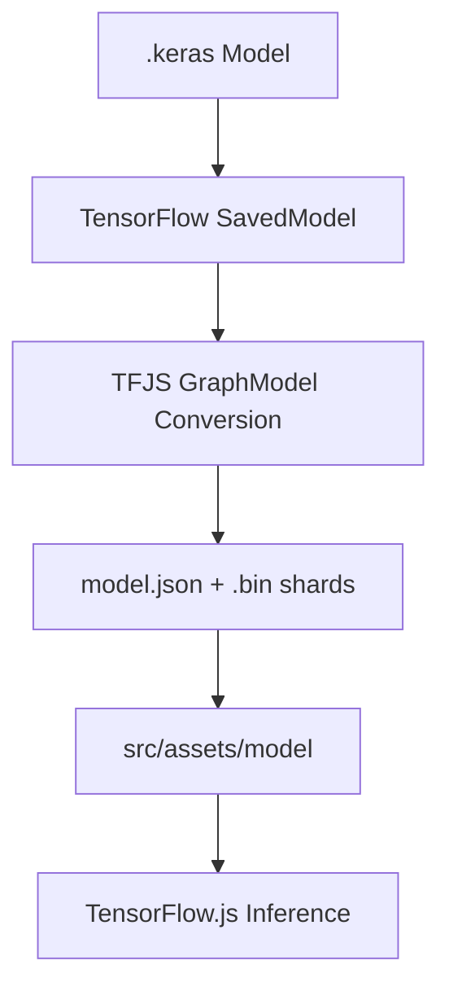
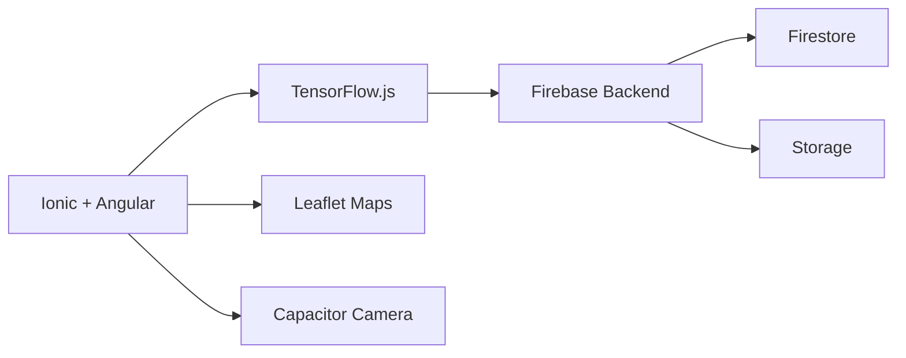
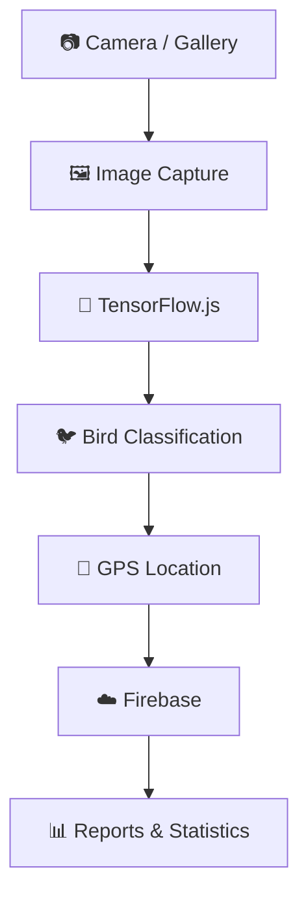

<div align="center">

# 🐦 BirdScope

### Intelligent Mobile Bird Recognition System using AI + TensorFlow.js

<br>


<br><br>


</div>

---

# 📱 Project Overview

BirdScope is a hybrid mobile application focused on intelligent bird recognition using Artificial Intelligence and Computer Vision techniques.

The system allows users to capture bird images directly from the mobile camera or upload images from the gallery and automatically classify species using a Deep Learning model trained with **41 bird species from Tolima, Colombia 🇨🇴**.

The application integrates modern mobile technologies, real-time cloud synchronization, geolocation systems, interactive maps, and on-device AI inference using TensorFlow.js.

---

# 🚀 Core Features

<div align="center">

| Feature | Description |
|---|---|
| 🧠 AI Classification | Real-time bird recognition |
| 📷 Camera Integration | Mobile camera capture |
| ☁️ Firebase Backend | Cloud synchronization |
| 📍 GPS Geolocation | Automatic location tracking |
| 🗺️ Interactive Maps | Leaflet + OpenStreetMap |
| 📊 Dynamic Reports | Real-time statistics |
| 📱 Mobile Optimized | Android/Web compatible |
| ⚡ TensorFlow.js | On-device inference |

</div>

---

# ✨ Main Modules

---

## 🏠 Home Dashboard

- Interactive dashboard
- Dynamic statistics
- Featured species
- Quick access modules
- Responsive UI design
- Real-time Firebase data

---

## 🧠 Intelligent Classification

- Camera capture
- Gallery image upload
- Real-time classification
- Top-3 predictions
- Confidence percentage
- Species confirmation
- Unknown species reporting
- Automatic image compression
- TensorFlow.js integration
- On-device inference

---

## 🌿 Species Catalog

- 41 registered species
- Real-time search engine
- Family filtering
- Dynamic sorting
- Interactive species modal
- Scientific information
- Habitat details
- Species recommendations
- Registered species detection

---

## 🗺️ Smart Interactive Map

- GPS bird sightings
- Dynamic markers
- Species color identification
- Smart search system
- Automatic map navigation
- Interactive popups
- Map/List visualization
- OpenStreetMap integration
- Leaflet rendering

---

## 📊 Reports & Statistics

- Total observations
- Unique species count
- Average AI confidence
- Full observation history
- Collection progress bars
- Latest sightings
- Firebase real-time statistics

---

# 🧠 Artificial Intelligence Pipeline

BirdScope uses a Deep Learning architecture optimized for mobile inference through Transfer Learning techniques.

---

## 🏗️ Model Architecture

| Model | Purpose |
|---|---|
| Parent CNN | Feature extraction |
| Child CNN | Mobile classification |
| TensorFlow.js | On-device inference |
| MobileNetV2 | Base architecture |

---

## 📦 Optimized Mobile Model

```txt
hijo_fase2_FINAL.keras
```

### Features

- 41 bird species classification
- TensorFlow.js optimized
- Fast mobile inference
- Android/Web compatible
- Offline inference support
- Lightweight architecture

---

# 🔄 TensorFlow.js Conversion Pipeline



---

# 📂 AI Model Structure

```txt
src/assets/model/
├── model.json
├── group1-shard1of3.bin
├── group1-shard2of3.bin
├── group1-shard3of3.bin
└── weights.bin
```

---

# 🐦 Supported Bird Species

The application recognizes **41 bird species from Tolima, Colombia**, including:

- Aguililla Caminera
- Bananaquit
- Chachalaca Colombiana
- Colibrí Florido de Tolima
- Halcón Peregrino
- Momoto Serrano
- Tángara Azulgris
- Zopilote Común
- Benteveo
- Tortolita Canela
- And many more...

---

# ☁️ Firebase Backend

BirdScope uses Firebase as a centralized backend infrastructure.

---

## 🔥 Integrated Firebase Services

<div align="center">

| Service | Purpose |
|---|---|
| Firestore | Bird sightings database |
| Firebase Storage | Image storage |
| Firebase Authentication | User management |

</div>

---

# 📄 Example Firestore Document

```json
{
  "especie": "Bananaquit",
  "confianza": 93,
  "imagen": "data:image/jpeg;base64,...",
  "latitud": 4.415071,
  "longitud": -75.174409,
  "fecha": "2026-05-08T05:54:30.061Z"
}
```

---

# 🤝 Shared Firebase Architecture

BirdScope uses a single Firebase project as a centralized backend system.

This architecture allows multiple development team members to run the application from different devices (PC or mobile) while working with the same real-time database and cloud infrastructure.

The system supports:

- Shared Firestore synchronization
- Shared image storage
- Real-time updates
- Collaborative development workflows
- Cross-device synchronization

---

# 🏗️ System Architecture



---

# 🔄 Application Workflow



---

# 📂 Project Structure

```txt
src/
├── app/
│   └── tabs/
│       ├── inicio/
│       ├── clasificar/
│       ├── especies/
│       ├── mapa/
│       └── reportes/
│
├── assets/
│   ├── model/
│   ├── icon/
│   └── images/
│
└── environments/
    └── environment.ts
```

---

# ⚙️ Installation Guide

---

## 📥 Clone Repository

```bash
git clone <repository-url>
```

---

## 📦 Install Dependencies

```bash
npm install --legacy-peer-deps
```

---

## ▶️ Run Development Server

```bash
ionic serve
```

---

## 🌐 Run on Local Network

```bash
ionic serve --host=0.0.0.0 --port=8100
```

---

# 📱 Android Build

```bash
ionic build
npx cap sync android
npx cap open android
```

---

# 🎨 UI/UX Features

- Modern responsive design
- Fluid animations
- Custom Ionic components
- Modular SCSS architecture
- Optimized mobile experience
- Visual state management
- Smooth transitions
- Interactive cards
- Dynamic layouts

---

# 🔒 Technical Optimizations

<div align="center">

| Optimization | Status |
|---|---|
| Automatic image compression | ✅ |
| Lazy loading views | ✅ |
| Local AI inference | ✅ |
| Angular Signals | ✅ |
| Efficient map rendering | ✅ |
| Firebase optimization | ✅ |
| Reactive data handling | ✅ |
| Mobile compatibility | ✅ |

</div>

---

# 🧪 Technologies Used

<div align="center">

| Technology | Purpose |
|---|---|
| Ionic | Hybrid Mobile Framework |
| Angular | Frontend Framework |
| TypeScript | Main Language |
| Capacitor | Native Hardware Access |
| TensorFlow.js | AI Inference |
| Firebase | Backend Infrastructure |
| Firestore | Real-time Database |
| Leaflet | Interactive Maps |
| OpenStreetMap | Map Provider |
| SCSS | UI Styling |
| Deep Learning | Bird Classification |

</div>

---

# 👨‍💻 Development Team

<div align="center">

## Electiva III

### Universidad Cooperativa de Colombia

Faculty of Engineering  
Ibagué, Tolima — Colombia 🇨🇴

<br>

### Developers

| Name | Role |
|---|---|
| Kevin Julian Guerrero Penagos | Backend • AI • Firebase |
| Laura Sophia Zapata Coronado | Frontend • UI/UX |

</div>

---

# 📌 Project Status

<div align="center">

| Module | Status |
|---|---|
| Mobile Application | ✅ |
| Firebase Integration | ✅ |
| TensorFlow.js AI | ✅ |
| Interactive Maps | ✅ |
| Real-time Classification | ✅ |
| Responsive UI | ✅ |
| Android Compatibility | ✅ |

</div>

---

# 📄 License

Academic Project — All Rights Reserved ©

---

<div align="center">

# 🐦 BirdScope

### Technology & Artificial Intelligence for Biodiversity Conservation

<br>

Developed with ❤️ using Ionic, Angular, Firebase & TensorFlow.js

<br>


</div>